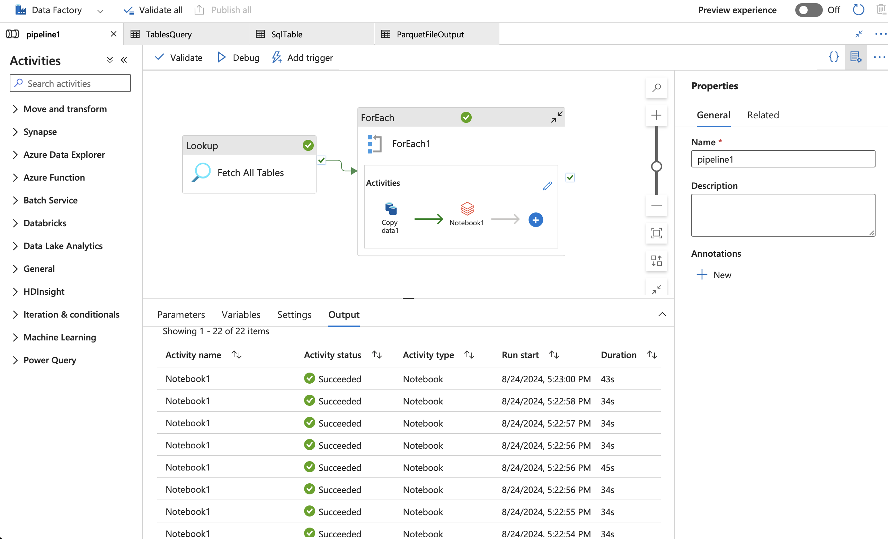

# End-to-End Data Engineering Project with Apache Spark, Azure Databricks, and DBT
This project showcases a complete data engineering pipeline utilizing Apache Spark, Azure Databricks, and the Data Build Tool (DBT), with Azure serving as the cloud provider.

## Key Components:

- **Data Ingestion**
  - Set up a Data Lake using the AdventureWorks dataset, initially storing raw data in the bronze layer as Parquet files.

- **Data Integration**
  - Used Azure Data Factory to orchestrate the data flow from ingestion to transformation.

- **Data Transformation** Leveraged Azure Databricks for data processing, implementing a medallion architecture that refines data through multiple layers:
  - **Bronze Layer:** 
    - Raw data ingestion in Parquet format.
  - **Silver Layer:** 
    - Cleaned and enriched data stored in Delta format for further transformations.
  - **Gold Layer:** 
    - Aggregated and business-ready data stored in Delta format for analysis and reporting.

- **Data Modeling**
  - Utilized DBT for SQL-based data transformations and modeling within the medallion architecture.

#

Try running the following commands:
- dbt run
- dbt test

### Resources:
- Learn more about dbt [in the docs](https://docs.getdbt.com/docs/introduction)
- Check out [Discourse](https://discourse.getdbt.com/) for commonly asked questions and answers
- Join the [chat](https://community.getdbt.com/) on Slack for live discussions and support
- Find [dbt events](https://events.getdbt.com) near you
- Check out [the blog](https://blog.getdbt.com/) for the latest news on dbt's development and best practices

